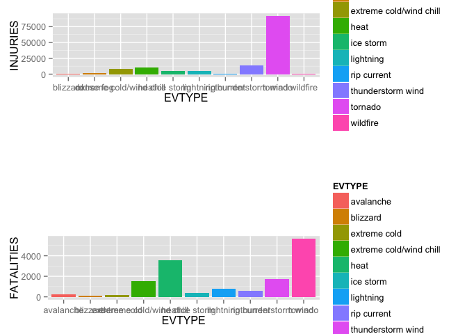
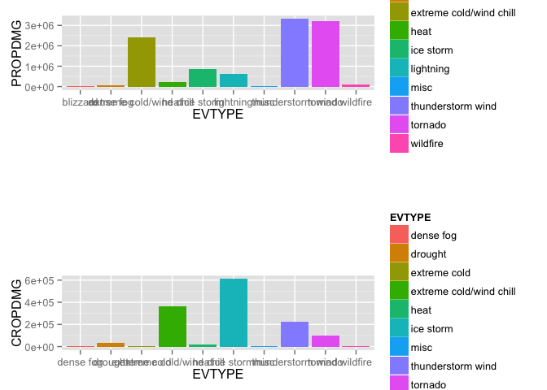

# Analysis of How Storms Affect Both Public Health and Economies in Communities and Municipalities
Ashwin Rao  
April 25, 2015  

## Introduction
Storms and other severe weather events can cause both public health and economic problems for communities and municipalities. Many severe events can result in fatalities, injuries, and property damage, and preventing such outcomes to the extent possible is a key concern.

This analysis involves exploring the U.S. National Oceanic and Atmospheric Administration's (NOAA) storm database. This database tracks characteristics of major storms and weather events in the United States, including when and where they occur, as well as estimates of any fatalities, injuries, and property damage.

## Data

The data for this assignment come in the form of a comma-separated-value file compressed via the bzip2 algorithm to reduce its size. You can download the file from the course web site:  

* [Storm Data](https://d396qusza40orc.cloudfront.net/repdata%2Fdata%2FStormData.csv.bz2) [47Mb]    

There is also some documentation of the database available. Here you will find how some of the variables are constructed/defined.

* National Weather Service [Storm Data Documentation](https://d396qusza40orc.cloudfront.net/repdata%2Fpeer2_doc%2Fpd01016005curr.pdf)

* National Climatic Data Center Storm Events [FAQ](https://d396qusza40orc.cloudfront.net/repdata%2Fpeer2_doc%2FNCDC%20Storm%20Events-FAQ%20Page.pdf)

The events in the database start in the year 1950 and end in November 2011. In the earlier years of the database there are generally fewer events recorded, most likely due to a lack of good records. More recent years should be considered more complete.

## Questions being answered
Your data analysis must address the following questions:

1) Across the United States, which types of events (as indicated in the EVTYPE variable) are most harmful with respect to population health?
1) Across the United States, which types of events have the greatest economic consequences?

This is purely a situational analysis, and no recommendation is required.

## Synopsis
The data was downloaded from the NWS website, and imported into the table. I found that the data was not very clean, as there were many incomplete records, and the input values had many typographical errors, and the the Events were mis-labeled. So the first step was to clean the data by replacing all the errors with known values. Then appropriate graphs were drawn to determine the answers to the above questions.

## Data Processing
I reset the environment by first changing the working folder to the folder where the code existed

```r
#setwd("~/Documents/DropBox-AGR/Dropbox/Git/coursera//Reproducible/RepData_PeerAssessment2/")
rm(list=ls())
```

Now I downloaded the file from the NWS website

```r
download.file(url = "https://d396qusza40orc.cloudfront.net/repdata%2Fdata%2FStormData.csv.bz2",destfile = "StormData.bzip2", method = "curl", mode = "wb")
```

I then read the new file directly into a table

```r
dt <- read.table("StormData.bzip2",na.strings = "", sep = ",", header = TRUE)

# I ran some summary statistic to understand the makeup of the data
# Summary
summary(dt)   
```

```
##     STATE__                  BGN_DATE             BGN_TIME     
##  Min.   : 1.0   5/25/2011 0:00:00:  1202   12:00:00 AM: 10163  
##  1st Qu.:19.0   4/27/2011 0:00:00:  1193   06:00:00 PM:  7350  
##  Median :30.0   6/9/2011 0:00:00 :  1030   04:00:00 PM:  7261  
##  Mean   :31.2   5/30/2004 0:00:00:  1016   05:00:00 PM:  6891  
##  3rd Qu.:45.0   4/4/2011 0:00:00 :  1009   12:00:00 PM:  6703  
##  Max.   :95.0   4/2/2006 0:00:00 :   981   03:00:00 PM:  6700  
##                 (Other)          :895866   (Other)    :857229  
##    TIME_ZONE          COUNTY           COUNTYNAME         STATE       
##  CST    :547493   Min.   :  0.0   JEFFERSON :  7840   TX     : 83728  
##  EST    :245558   1st Qu.: 31.0   WASHINGTON:  7603   KS     : 53440  
##  MST    : 68390   Median : 75.0   JACKSON   :  6660   OK     : 46802  
##  PST    : 28302   Mean   :100.6   FRANKLIN  :  6256   MO     : 35648  
##  AST    :  6360   3rd Qu.:131.0   LINCOLN   :  5937   IA     : 31069  
##  HST    :  2563   Max.   :873.0   (Other)   :866412   NE     : 30271  
##  (Other):  3631                   NA's      :  1589   (Other):621339  
##                EVTYPE         BGN_RANGE           BGN_AZI      
##  HAIL             :288661   Min.   :   0.000   N      : 86752  
##  TSTM WIND        :219940   1st Qu.:   0.000   W      : 38446  
##  THUNDERSTORM WIND: 82563   Median :   0.000   S      : 37558  
##  TORNADO          : 60652   Mean   :   1.484   E      : 33178  
##  FLASH FLOOD      : 54277   3rd Qu.:   1.000   NW     : 24041  
##  FLOOD            : 25326   Max.   :3749.000   (Other):134990  
##  (Other)          :170878                      NA's   :547332  
##          BGN_LOCATI                  END_DATE             END_TIME     
##  COUNTYWIDE   : 19680   4/27/2011 0:00:00:  1214   06:00:00 PM:  9802  
##  Countywide   :   993   5/25/2011 0:00:00:  1196   05:00:00 PM:  8314  
##  SPRINGFIELD  :   843   6/9/2011 0:00:00 :  1021   04:00:00 PM:  8104  
##  SOUTH PORTION:   810   4/4/2011 0:00:00 :  1007   12:00:00 PM:  7483  
##  NORTH PORTION:   784   5/30/2004 0:00:00:   998   11:59:00 PM:  7184  
##  (Other)      :591444   (Other)          :653450   (Other)    :622432  
##  NA's         :287743   NA's             :243411   NA's       :238978  
##    COUNTY_END COUNTYENDN       END_RANGE           END_AZI      
##  Min.   :0    Mode:logical   Min.   :  0.0000   N      : 28082  
##  1st Qu.:0    NA's:902297    1st Qu.:  0.0000   S      : 22510  
##  Median :0                   Median :  0.0000   W      : 20119  
##  Mean   :0                   Mean   :  0.9862   E      : 20047  
##  3rd Qu.:0                   3rd Qu.:  0.0000   NE     : 14606  
##  Max.   :0                   Max.   :925.0000   (Other): 72096  
##                                                 NA's   :724837  
##            END_LOCATI         LENGTH              WIDTH         
##  COUNTYWIDE     : 19731   Min.   :   0.0000   Min.   :   0.000  
##  SOUTH PORTION  :   833   1st Qu.:   0.0000   1st Qu.:   0.000  
##  NORTH PORTION  :   780   Median :   0.0000   Median :   0.000  
##  CENTRAL PORTION:   617   Mean   :   0.2301   Mean   :   7.503  
##  SPRINGFIELD    :   575   3rd Qu.:   0.0000   3rd Qu.:   0.000  
##  (Other)        :380536   Max.   :2315.0000   Max.   :4400.000  
##  NA's           :499225                                         
##        F               MAG            FATALITIES          INJURIES        
##  Min.   :0.0      Min.   :    0.0   Min.   :  0.0000   Min.   :   0.0000  
##  1st Qu.:0.0      1st Qu.:    0.0   1st Qu.:  0.0000   1st Qu.:   0.0000  
##  Median :1.0      Median :   50.0   Median :  0.0000   Median :   0.0000  
##  Mean   :0.9      Mean   :   46.9   Mean   :  0.0168   Mean   :   0.1557  
##  3rd Qu.:1.0      3rd Qu.:   75.0   3rd Qu.:  0.0000   3rd Qu.:   0.0000  
##  Max.   :5.0      Max.   :22000.0   Max.   :583.0000   Max.   :1700.0000  
##  NA's   :843563                                                           
##     PROPDMG          PROPDMGEXP        CROPDMG          CROPDMGEXP    
##  Min.   :   0.00   K      :424665   Min.   :  0.000   K      :281832  
##  1st Qu.:   0.00   M      : 11330   1st Qu.:  0.000   M      :  1994  
##  Median :   0.00   0      :   216   Median :  0.000   k      :    21  
##  Mean   :  12.06   B      :    40   Mean   :  1.527   0      :    19  
##  3rd Qu.:   0.50   5      :    28   3rd Qu.:  0.000   B      :     9  
##  Max.   :5000.00   (Other):    84   Max.   :990.000   (Other):     9  
##                    NA's   :465934                     NA's   :618413  
##       WFO                                       STATEOFFIC    
##  OUN    : 17393   TEXAS, North                       : 12193  
##  JAN    : 13889   ARKANSAS, Central and North Central: 11738  
##  LWX    : 13174   IOWA, Central                      : 11345  
##  PHI    : 12551   KANSAS, Southwest                  : 11212  
##  TSA    : 12483   GEORGIA, North and Central         : 11120  
##  (Other):690738   (Other)                            :595920  
##  NA's   :142069   NA's                               :248769  
##                                                                                                                                                                                                     ZONENAMES     
##                                                                                                                                                                                                          :205988  
##  GREATER RENO / CARSON CITY / M - GREATER RENO / CARSON CITY / M                                                                                                                                         :   639  
##  GREATER LAKE TAHOE AREA - GREATER LAKE TAHOE AREA                                                                                                                                                       :   592  
##  JEFFERSON - JEFFERSON                                                                                                                                                                                   :   303  
##  MADISON - MADISON                                                                                                                                                                                       :   302  
##  (Other)                                                                                                                                                                                                 :100444  
##  NA's                                                                                                                                                                                                    :594029  
##     LATITUDE      LONGITUDE        LATITUDE_E     LONGITUDE_    
##  Min.   :   0   Min.   :-14451   Min.   :   0   Min.   :-14455  
##  1st Qu.:2802   1st Qu.:  7247   1st Qu.:   0   1st Qu.:     0  
##  Median :3540   Median :  8707   Median :   0   Median :     0  
##  Mean   :2875   Mean   :  6940   Mean   :1452   Mean   :  3509  
##  3rd Qu.:4019   3rd Qu.:  9605   3rd Qu.:3549   3rd Qu.:  8735  
##  Max.   :9706   Max.   : 17124   Max.   :9706   Max.   :106220  
##  NA's   :47                      NA's   :40                     
##                                            REMARKS           REFNUM      
##                                                : 24013   Min.   :     1  
##  Trees down.\n                                 :  1110   1st Qu.:225575  
##  Several trees were blown down.\n              :   568   Median :451149  
##  Trees were downed.\n                          :   446   Mean   :451149  
##  Large trees and power lines were blown down.\n:   432   3rd Qu.:676723  
##  (Other)                                       :588295   Max.   :902297  
##  NA's                                          :287433
```

```r
# Str function
str(dt)
```

```
## 'data.frame':	902297 obs. of  37 variables:
##  $ STATE__   : num  1 1 1 1 1 1 1 1 1 1 ...
##  $ BGN_DATE  : Factor w/ 16335 levels "1/1/1966 0:00:00",..: 6523 6523 4242 11116 2224 2224 2260 383 3980 3980 ...
##  $ BGN_TIME  : Factor w/ 3608 levels "00:00:00 AM",..: 272 287 2705 1683 2584 3186 242 1683 3186 3186 ...
##  $ TIME_ZONE : Factor w/ 22 levels "ADT","AKS","AST",..: 7 7 7 7 7 7 7 7 7 7 ...
##  $ COUNTY    : num  97 3 57 89 43 77 9 123 125 57 ...
##  $ COUNTYNAME: Factor w/ 29600 levels "5NM E OF MACKINAC BRIDGE TO PRESQUE ISLE LT MI",..: 13512 1872 4597 10591 4371 10093 1972 23872 24417 4597 ...
##  $ STATE     : Factor w/ 72 levels "AK","AL","AM",..: 2 2 2 2 2 2 2 2 2 2 ...
##  $ EVTYPE    : Factor w/ 985 levels "   HIGH SURF ADVISORY",..: 834 834 834 834 834 834 834 834 834 834 ...
##  $ BGN_RANGE : num  0 0 0 0 0 0 0 0 0 0 ...
##  $ BGN_AZI   : Factor w/ 34 levels "  N"," NW","E",..: NA NA NA NA NA NA NA NA NA NA ...
##  $ BGN_LOCATI: Factor w/ 54428 levels " Christiansburg",..: NA NA NA NA NA NA NA NA NA NA ...
##  $ END_DATE  : Factor w/ 6662 levels "1/1/1993 0:00:00",..: NA NA NA NA NA NA NA NA NA NA ...
##  $ END_TIME  : Factor w/ 3646 levels " 0900CST"," 200CST",..: NA NA NA NA NA NA NA NA NA NA ...
##  $ COUNTY_END: num  0 0 0 0 0 0 0 0 0 0 ...
##  $ COUNTYENDN: logi  NA NA NA NA NA NA ...
##  $ END_RANGE : num  0 0 0 0 0 0 0 0 0 0 ...
##  $ END_AZI   : Factor w/ 23 levels "E","ENE","ESE",..: NA NA NA NA NA NA NA NA NA NA ...
##  $ END_LOCATI: Factor w/ 34505 levels " CANTON"," TULIA",..: NA NA NA NA NA NA NA NA NA NA ...
##  $ LENGTH    : num  14 2 0.1 0 0 1.5 1.5 0 3.3 2.3 ...
##  $ WIDTH     : num  100 150 123 100 150 177 33 33 100 100 ...
##  $ F         : int  3 2 2 2 2 2 2 1 3 3 ...
##  $ MAG       : num  0 0 0 0 0 0 0 0 0 0 ...
##  $ FATALITIES: num  0 0 0 0 0 0 0 0 1 0 ...
##  $ INJURIES  : num  15 0 2 2 2 6 1 0 14 0 ...
##  $ PROPDMG   : num  25 2.5 25 2.5 2.5 2.5 2.5 2.5 25 25 ...
##  $ PROPDMGEXP: Factor w/ 18 levels "-","?","+","0",..: 16 16 16 16 16 16 16 16 16 16 ...
##  $ CROPDMG   : num  0 0 0 0 0 0 0 0 0 0 ...
##  $ CROPDMGEXP: Factor w/ 8 levels "?","0","2","B",..: NA NA NA NA NA NA NA NA NA NA ...
##  $ WFO       : Factor w/ 541 levels " CI","%SD","$AC",..: NA NA NA NA NA NA NA NA NA NA ...
##  $ STATEOFFIC: Factor w/ 249 levels "ALABAMA, Central",..: NA NA NA NA NA NA NA NA NA NA ...
##  $ ZONENAMES : Factor w/ 25111 levels "                                                                                                                               "| __truncated__,..: NA NA NA NA NA NA NA NA NA NA ...
##  $ LATITUDE  : num  3040 3042 3340 3458 3412 ...
##  $ LONGITUDE : num  8812 8755 8742 8626 8642 ...
##  $ LATITUDE_E: num  3051 0 0 0 0 ...
##  $ LONGITUDE_: num  8806 0 0 0 0 ...
##  $ REMARKS   : Factor w/ 436780 levels "\t","\t\t","\t\t\t\t",..: NA NA NA NA NA NA NA NA NA NA ...
##  $ REFNUM    : num  1 2 3 4 5 6 7 8 9 10 ...
```

```r
# I also printed the first 20 rows to get a feel for the data
head(dt, 20)
```

```
##    STATE__           BGN_DATE BGN_TIME TIME_ZONE COUNTY COUNTYNAME STATE
## 1        1  4/18/1950 0:00:00     0130       CST     97     MOBILE    AL
## 2        1  4/18/1950 0:00:00     0145       CST      3    BALDWIN    AL
## 3        1  2/20/1951 0:00:00     1600       CST     57    FAYETTE    AL
## 4        1   6/8/1951 0:00:00     0900       CST     89    MADISON    AL
## 5        1 11/15/1951 0:00:00     1500       CST     43    CULLMAN    AL
## 6        1 11/15/1951 0:00:00     2000       CST     77 LAUDERDALE    AL
## 7        1 11/16/1951 0:00:00     0100       CST      9     BLOUNT    AL
## 8        1  1/22/1952 0:00:00     0900       CST    123 TALLAPOOSA    AL
## 9        1  2/13/1952 0:00:00     2000       CST    125 TUSCALOOSA    AL
## 10       1  2/13/1952 0:00:00     2000       CST     57    FAYETTE    AL
## 11       1  2/13/1952 0:00:00     2030       CST     43    CULLMAN    AL
## 12       1  2/13/1952 0:00:00     2030       CST      9     BLOUNT    AL
## 13       1  2/13/1952 0:00:00     2130       CST     73  JEFFERSON    AL
## 14       1  2/29/1952 0:00:00     1700       CST     49     DEKALB    AL
## 15       1   3/3/1952 0:00:00     1310       CST    107    PICKENS    AL
## 16       1  3/22/1952 0:00:00     1500       CST    103     MORGAN    AL
## 17       1   4/4/1952 0:00:00     0620       CST     97     MOBILE    AL
## 18       1  5/10/1952 0:00:00     0900       CST     57    FAYETTE    AL
## 19       1  5/10/1952 0:00:00     0900       CST     57    FAYETTE    AL
## 20       1  5/10/1952 0:00:00     0900       CST     57    FAYETTE    AL
##     EVTYPE BGN_RANGE BGN_AZI BGN_LOCATI END_DATE END_TIME COUNTY_END
## 1  TORNADO         0    <NA>       <NA>     <NA>     <NA>          0
## 2  TORNADO         0    <NA>       <NA>     <NA>     <NA>          0
## 3  TORNADO         0    <NA>       <NA>     <NA>     <NA>          0
## 4  TORNADO         0    <NA>       <NA>     <NA>     <NA>          0
## 5  TORNADO         0    <NA>       <NA>     <NA>     <NA>          0
## 6  TORNADO         0    <NA>       <NA>     <NA>     <NA>          0
## 7  TORNADO         0    <NA>       <NA>     <NA>     <NA>          0
## 8  TORNADO         0    <NA>       <NA>     <NA>     <NA>          0
## 9  TORNADO         0    <NA>       <NA>     <NA>     <NA>          0
## 10 TORNADO         0    <NA>       <NA>     <NA>     <NA>          0
## 11 TORNADO         0    <NA>       <NA>     <NA>     <NA>          0
## 12 TORNADO         0    <NA>       <NA>     <NA>     <NA>          0
## 13 TORNADO         0    <NA>       <NA>     <NA>     <NA>          0
## 14 TORNADO         0    <NA>       <NA>     <NA>     <NA>          0
## 15 TORNADO         0    <NA>       <NA>     <NA>     <NA>          0
## 16 TORNADO         0    <NA>       <NA>     <NA>     <NA>          0
## 17 TORNADO         0    <NA>       <NA>     <NA>     <NA>          0
## 18 TORNADO         0    <NA>       <NA>     <NA>     <NA>          0
## 19 TORNADO         0    <NA>       <NA>     <NA>     <NA>          0
## 20 TORNADO         0    <NA>       <NA>     <NA>     <NA>          0
##    COUNTYENDN END_RANGE END_AZI END_LOCATI LENGTH WIDTH F MAG FATALITIES
## 1          NA         0    <NA>       <NA>   14.0   100 3   0          0
## 2          NA         0    <NA>       <NA>    2.0   150 2   0          0
## 3          NA         0    <NA>       <NA>    0.1   123 2   0          0
## 4          NA         0    <NA>       <NA>    0.0   100 2   0          0
## 5          NA         0    <NA>       <NA>    0.0   150 2   0          0
## 6          NA         0    <NA>       <NA>    1.5   177 2   0          0
## 7          NA         0    <NA>       <NA>    1.5    33 2   0          0
## 8          NA         0    <NA>       <NA>    0.0    33 1   0          0
## 9          NA         0    <NA>       <NA>    3.3   100 3   0          1
## 10         NA         0    <NA>       <NA>    2.3   100 3   0          0
## 11         NA         0    <NA>       <NA>    1.3   400 1   0          0
## 12         NA         0    <NA>       <NA>    4.7   400 1   0          0
## 13         NA         0    <NA>       <NA>    0.0   200 3   0          1
## 14         NA         0    <NA>       <NA>    3.3   400 3   0          0
## 15         NA         0    <NA>       <NA>    3.3   440 3   0          0
## 16         NA         0    <NA>       <NA>   21.6   100 4   0          4
## 17         NA         0    <NA>       <NA>    0.2   200 1   0          0
## 18         NA         0    <NA>       <NA>    0.2    50 1   0          0
## 19         NA         0    <NA>       <NA>    0.2    50 1   0          0
## 20         NA         0    <NA>       <NA>    0.2    50 1   0          0
##    INJURIES PROPDMG PROPDMGEXP CROPDMG CROPDMGEXP  WFO STATEOFFIC
## 1        15    25.0          K       0       <NA> <NA>       <NA>
## 2         0     2.5          K       0       <NA> <NA>       <NA>
## 3         2    25.0          K       0       <NA> <NA>       <NA>
## 4         2     2.5          K       0       <NA> <NA>       <NA>
## 5         2     2.5          K       0       <NA> <NA>       <NA>
## 6         6     2.5          K       0       <NA> <NA>       <NA>
## 7         1     2.5          K       0       <NA> <NA>       <NA>
## 8         0     2.5          K       0       <NA> <NA>       <NA>
## 9        14    25.0          K       0       <NA> <NA>       <NA>
## 10        0    25.0          K       0       <NA> <NA>       <NA>
## 11        3     2.5          M       0       <NA> <NA>       <NA>
## 12        3     2.5          M       0       <NA> <NA>       <NA>
## 13       26   250.0          K       0       <NA> <NA>       <NA>
## 14       12     0.0          K       0       <NA> <NA>       <NA>
## 15        6    25.0          K       0       <NA> <NA>       <NA>
## 16       50    25.0          K       0       <NA> <NA>       <NA>
## 17        2    25.0          K       0       <NA> <NA>       <NA>
## 18        0    25.0          K       0       <NA> <NA>       <NA>
## 19        0    25.0          K       0       <NA> <NA>       <NA>
## 20        0    25.0          K       0       <NA> <NA>       <NA>
##    ZONENAMES LATITUDE LONGITUDE LATITUDE_E LONGITUDE_ REMARKS REFNUM
## 1       <NA>     3040      8812       3051       8806    <NA>      1
## 2       <NA>     3042      8755          0          0    <NA>      2
## 3       <NA>     3340      8742          0          0    <NA>      3
## 4       <NA>     3458      8626          0          0    <NA>      4
## 5       <NA>     3412      8642          0          0    <NA>      5
## 6       <NA>     3450      8748          0          0    <NA>      6
## 7       <NA>     3405      8631          0          0    <NA>      7
## 8       <NA>     3255      8558          0          0    <NA>      8
## 9       <NA>     3334      8740       3336       8738    <NA>      9
## 10      <NA>     3336      8738       3337       8737    <NA>     10
## 11      <NA>     3401      8645       3402       8644    <NA>     11
## 12      <NA>     3402      8644       3404       8640    <NA>     12
## 13      <NA>     3336      8656          0          0    <NA>     13
## 14      <NA>     3430      8542       3432       8540    <NA>     14
## 15      <NA>     3320      8754       3322       8752    <NA>     15
## 16      <NA>     3436      8700       3441       8638    <NA>     16
## 17      <NA>     3042      8817          0          0    <NA>     17
## 18      <NA>     3344      8745          0          0    <NA>     18
## 19      <NA>     3344      8745          0          0    <NA>     19
## 20      <NA>     3344      8745          0          0    <NA>     20
```
I copied the "Known" Events from the [Storm-Data-Export-Format.docx file](ftp://ftp.ncdc.noaa.gov/pub/data/swdi/stormevents/csvfiles/Storm-Data-Export-Format.docx) and put them in the event.csv as reference, so I can use these to normalize all errors. After looking at "str" output, I realized that the EVTYPE attribute, which is to be the center of my inquery, had a lot of typographical errors, and values that didn't correspond to the documentation, so I knew that this data needed cleanup. 


```r
# From ftp://ftp.ncdc.noaa.gov/pub/data/swdi/stormevents/csvfiles/Storm-Data-Export-Format.docx
eventsRead <- readLines("event.csv", n=1)
events <- strsplit(x = eventsRead, split = ",")

# I normalized all these events to lower case for further processing
events <- sapply(X = events,FUN = tolower)
events
```

```
##       [,1]                      
##  [1,] "astronomical low tide"   
##  [2,] "avalanche"               
##  [3,] "blizzard"                
##  [4,] "coastal flood"           
##  [5,] "cold/wind chill"         
##  [6,] "debris flow"             
##  [7,] "dense fog"               
##  [8,] "dense smoke"             
##  [9,] "drought"                 
## [10,] "dust devil"              
## [11,] "dust storm"              
## [12,] "excessive heat"          
## [13,] "extreme cold/wind chill" 
## [14,] "flash flood"             
## [15,] "flood"                   
## [16,] "frost/freeze"            
## [17,] "funnel cloud"            
## [18,] "freezing fog"            
## [19,] "hail"                    
## [20,] "heat"                    
## [21,] "heavy rain"              
## [22,] "heavy snow"              
## [23,] "high surf"               
## [24,] "high wind"               
## [25,] "hurricane (typhoon)"     
## [26,] "ice storm"               
## [27,] "lake-effect snow"        
## [28,] "lakeshore flood"         
## [29,] "lightning"               
## [30,] "marine hail"             
## [31,] "marine high wind"        
## [32,] "marine strong wind"      
## [33,] "marine thunderstorm wind"
## [34,] "rip current"             
## [35,] "seiche"                  
## [36,] "sleet"                   
## [37,] "storm surge/tide"        
## [38,] "strong wind"             
## [39,] "thunderstorm wind"       
## [40,] "tornado"                 
## [41,] "tropical depression"     
## [42,] "tropical storm"          
## [43,] "tsunami"                 
## [44,] "volcanic ash"            
## [45,] "waterspout"              
## [46,] "wildfire"                
## [47,] "winter storm"            
## [48,] "winter weather"
```

I therefore made a copy of the table to ensure that the original table was intact.

```r
dtProcessed <- dt
```

I then did some cleanup of the data in the following way

```r
dtProcessed$EVTYPE <-  sapply(X = dtProcessed$EVTYPE,FUN = tolower)
# I got a list of unique EVTYPE values
origEVTYPE <- unique(factor(dtProcessed$EVTYPE))

# I then converted these values into lower case values, so they could be compared with the standard Event's list that was retrieved earlier.
origEVTYPE <- sapply(X = origEVTYPE,FUN = tolower)

# I then checked how many of these values were not in the standard list 
origEVTYPE.unresolved <- origEVTYPE[!origEVTYPE %in% events]
str(origEVTYPE.unresolved) # Gave me more information on the number that were not in the standard list.
```

```
##  chr [1:852] "tstm wind" "freezing rain" "snow" ...
```

```r
# I slowly replaced the mis-labeled, mis-typed values based on my understanding of the domain
dtProcessed[grep("*wind*", dtProcessed$EVTYPE),]$EVTYPE <- "thunderstorm wind"
dtProcessed[grep("*storm surge*", dtProcessed$EVTYPE),]$EVTYPE <- "thunderstorm wind"
dtProcessed[grep("*freez*", dtProcessed$EVTYPE),]$EVTYPE <- "ice storm"
dtProcessed[grep("*hail*", dtProcessed$EVTYPE),]$EVTYPE <- "ice storm"
dtProcessed[grep("*ice*", dtProcessed$EVTYPE),]$EVTYPE <- "ice storm"
dtProcessed[grep("*frost*", dtProcessed$EVTYPE),]$EVTYPE <- "ice storm"
dtProcessed[grep("*glaze*", dtProcessed$EVTYPE),]$EVTYPE <- "ice storm"
dtProcessed[grep("*coastal*", dtProcessed$EVTYPE),]$EVTYPE <- "marine strong wind"
dtProcessed[grep("*snow*", dtProcessed$EVTYPE),]$EVTYPE <- "heavy snow"
dtProcessed[grep("summary*", dtProcessed$EVTYPE),]$EVTYPE <- "summary"
#dtProcessed[grep("*hurricane*", dtProcessed$EVTYPE),]$EVTYPE <- "hurricane (typhoon)"
#dtProcessed[grep("*cold*", dtProcessed$EVTYPE),]$EVTYPE <- "frost/freeze"
dtProcessed[grep("*flash flooding*", dtProcessed$EVTYPE),]$EVTYPE <- "flash flood"
dtProcessed[grep("*lightning*", dtProcessed$EVTYPE),]$EVTYPE <- "lightning"
dtProcessed[grep("*ligntning*", dtProcessed$EVTYPE),]$EVTYPE <- "lightning"
dtProcessed[grep("*lighting*", dtProcessed$EVTYPE),]$EVTYPE <- "lightning"
#dtProcessed[grep("*cloud*", dtProcessed$EVTYPE),]$EVTYPE <- "funnel cloud"
dtProcessed[grep("*spout*", dtProcessed$EVTYPE),]$EVTYPE <- "funnel cloud"
#dtProcessed[grep("*microburst*", dtProcessed$EVTYPE),]$EVTYPE <- "heavy rain"
dtProcessed[grep("*mudslide*", dtProcessed$EVTYPE),]$EVTYPE <- "avalanche"
dtProcessed[grep("*mud slide*", dtProcessed$EVTYPE),]$EVTYPE <- "avalanche"
dtProcessed[grep("*mud*", dtProcessed$EVTYPE),]$EVTYPE <- "avalanche"
dtProcessed[grep("*landslide*", dtProcessed$EVTYPE),]$EVTYPE <- "avalanche"
dtProcessed[grep("*avalance*", dtProcessed$EVTYPE),]$EVTYPE <- "avalanche"
dtProcessed[grep("*fog*", dtProcessed$EVTYPE),]$EVTYPE <- "dense fog"
dtProcessed[grep("*tornado*", dtProcessed$EVTYPE),]$EVTYPE <- "tornado"
dtProcessed[grep("*gustnado*", dtProcessed$EVTYPE),]$EVTYPE <- "tornado"
dtProcessed[grep("*rains*", dtProcessed$EVTYPE),]$EVTYPE <- "heavy rain"
dtProcessed[grep("*downburst*", dtProcessed$EVTYPE),]$EVTYPE <- "heavy rain"
dtProcessed[grep("*wet*", dtProcessed$EVTYPE),]$EVTYPE <- "heavy rain"
dtProcessed[grep("*precipitation*", dtProcessed$EVTYPE),]$EVTYPE <- "heavy rain"
dtProcessed[grep("*dry*", dtProcessed$EVTYPE),]$EVTYPE <- "drought"
dtProcessed[grep("*funnel*", dtProcessed$EVTYPE),]$EVTYPE <- "tornado"
dtProcessed[grep("*torndao*", dtProcessed$EVTYPE),]$EVTYPE <- "tornado"
#dtProcessed[grep("*beach*", dtProcessed$EVTYPE),]$EVTYPE <- "coastal flood"
dtProcessed[grep("*thunder*", dtProcessed$EVTYPE),]$EVTYPE <- "thunderstorm wind"
dtProcessed[grep("*blizzard*", dtProcessed$EVTYPE),]$EVTYPE <- "blizzard"
dtProcessed[grep("*flood*", dtProcessed$EVTYPE),]$EVTYPE <- "flood"
dtProcessed[grep("*high*", dtProcessed$EVTYPE),]$EVTYPE <- "heat"
dtProcessed[grep("*heat*", dtProcessed$EVTYPE),]$EVTYPE <- "heat"
dtProcessed[grep("*hot*", dtProcessed$EVTYPE),]$EVTYPE <- "heat"
dtProcessed[grep("*excessive*", dtProcessed$EVTYPE),]$EVTYPE <- "heat"
dtProcessed[grep("*warm*", dtProcessed$EVTYPE),]$EVTYPE <- "heat"
dtProcessed[grep("*record*", dtProcessed$EVTYPE),]$EVTYPE <- "heat"
#dtProcessed[grep("*cold*", (dtProcessed$EVTYPE),]$EVTYPE <- "extreme cold/wind chill"
dtProcessed[grep("*low*", dtProcessed$EVTYPE),]$EVTYPE <- "extreme cold/wind chill"
dtProcessed[grep("*fire*", dtProcessed$EVTYPE),]$EVTYPE <- "wildfire"
dtProcessed[grep("*turbulence*", dtProcessed$EVTYPE),]$EVTYPE <- "tornado"
dtProcessed[grep("*marine*", dtProcessed$EVTYPE),]$EVTYPE <- "marine thunderstorm wind"
dtProcessed[grep("*urban*", dtProcessed$EVTYPE),]$EVTYPE <- "misc"
dtProcessed[grep("*apache*", dtProcessed$EVTYPE),]$EVTYPE <- "misc"
dtProcessed[grep("*other*", dtProcessed$EVTYPE),]$EVTYPE <- "misc"
#dtProcessed[grep("*?*", dtProcessed$EVTYPE),]$EVTYPE <- "misc"
dtProcessed[grep("*rip*", dtProcessed$EVTYPE),]$EVTYPE <- "rip current"

str(dtProcessed)
```

```
## 'data.frame':	902297 obs. of  37 variables:
##  $ STATE__   : num  1 1 1 1 1 1 1 1 1 1 ...
##  $ BGN_DATE  : Factor w/ 16335 levels "1/1/1966 0:00:00",..: 6523 6523 4242 11116 2224 2224 2260 383 3980 3980 ...
##  $ BGN_TIME  : Factor w/ 3608 levels "00:00:00 AM",..: 272 287 2705 1683 2584 3186 242 1683 3186 3186 ...
##  $ TIME_ZONE : Factor w/ 22 levels "ADT","AKS","AST",..: 7 7 7 7 7 7 7 7 7 7 ...
##  $ COUNTY    : num  97 3 57 89 43 77 9 123 125 57 ...
##  $ COUNTYNAME: Factor w/ 29600 levels "5NM E OF MACKINAC BRIDGE TO PRESQUE ISLE LT MI",..: 13512 1872 4597 10591 4371 10093 1972 23872 24417 4597 ...
##  $ STATE     : Factor w/ 72 levels "AK","AL","AM",..: 2 2 2 2 2 2 2 2 2 2 ...
##  $ EVTYPE    : chr  "tornado" "tornado" "tornado" "tornado" ...
##  $ BGN_RANGE : num  0 0 0 0 0 0 0 0 0 0 ...
##  $ BGN_AZI   : Factor w/ 34 levels "  N"," NW","E",..: NA NA NA NA NA NA NA NA NA NA ...
##  $ BGN_LOCATI: Factor w/ 54428 levels " Christiansburg",..: NA NA NA NA NA NA NA NA NA NA ...
##  $ END_DATE  : Factor w/ 6662 levels "1/1/1993 0:00:00",..: NA NA NA NA NA NA NA NA NA NA ...
##  $ END_TIME  : Factor w/ 3646 levels " 0900CST"," 200CST",..: NA NA NA NA NA NA NA NA NA NA ...
##  $ COUNTY_END: num  0 0 0 0 0 0 0 0 0 0 ...
##  $ COUNTYENDN: logi  NA NA NA NA NA NA ...
##  $ END_RANGE : num  0 0 0 0 0 0 0 0 0 0 ...
##  $ END_AZI   : Factor w/ 23 levels "E","ENE","ESE",..: NA NA NA NA NA NA NA NA NA NA ...
##  $ END_LOCATI: Factor w/ 34505 levels " CANTON"," TULIA",..: NA NA NA NA NA NA NA NA NA NA ...
##  $ LENGTH    : num  14 2 0.1 0 0 1.5 1.5 0 3.3 2.3 ...
##  $ WIDTH     : num  100 150 123 100 150 177 33 33 100 100 ...
##  $ F         : int  3 2 2 2 2 2 2 1 3 3 ...
##  $ MAG       : num  0 0 0 0 0 0 0 0 0 0 ...
##  $ FATALITIES: num  0 0 0 0 0 0 0 0 1 0 ...
##  $ INJURIES  : num  15 0 2 2 2 6 1 0 14 0 ...
##  $ PROPDMG   : num  25 2.5 25 2.5 2.5 2.5 2.5 2.5 25 25 ...
##  $ PROPDMGEXP: Factor w/ 18 levels "-","?","+","0",..: 16 16 16 16 16 16 16 16 16 16 ...
##  $ CROPDMG   : num  0 0 0 0 0 0 0 0 0 0 ...
##  $ CROPDMGEXP: Factor w/ 8 levels "?","0","2","B",..: NA NA NA NA NA NA NA NA NA NA ...
##  $ WFO       : Factor w/ 541 levels " CI","%SD","$AC",..: NA NA NA NA NA NA NA NA NA NA ...
##  $ STATEOFFIC: Factor w/ 249 levels "ALABAMA, Central",..: NA NA NA NA NA NA NA NA NA NA ...
##  $ ZONENAMES : Factor w/ 25111 levels "                                                                                                                               "| __truncated__,..: NA NA NA NA NA NA NA NA NA NA ...
##  $ LATITUDE  : num  3040 3042 3340 3458 3412 ...
##  $ LONGITUDE : num  8812 8755 8742 8626 8642 ...
##  $ LATITUDE_E: num  3051 0 0 0 0 ...
##  $ LONGITUDE_: num  8806 0 0 0 0 ...
##  $ REMARKS   : Factor w/ 436780 levels "\t","\t\t","\t\t\t\t",..: NA NA NA NA NA NA NA NA NA NA ...
##  $ REFNUM    : num  1 2 3 4 5 6 7 8 9 10 ...
```
## Results

Now that I had fixed all the errors, it is time to answer the questions!!!   

### Q1: Across the United States, which types of events (as indicated in the EVTYPE variable) are most harmful with respect to population health?

In order to calculate this, I had to aggregate the data for each of the events for Injuries & Fatalities

```r
## First I had to analyze the injuries
aggdata.injuries <- aggregate(INJURIES ~ EVTYPE, dtProcessed, sum,  na.rm=TRUE)

## I then sorted the results & took the top 10 results, as they were the most relevant ones to answer our question.
aggdata.injuries.sorted <- head(aggdata.injuries[order(-aggdata.injuries$INJURIES),],10)
aggdata.injuries.sorted
```

```
##                     EVTYPE INJURIES
## 51                 tornado    91439
## 50       thunderstorm wind    13548
## 24                    heat    10863
## 22 extreme cold/wind chill     8595
## 26               ice storm     5564
## 28               lightning     5231
## 13               dense fog     1622
## 61                wildfire     1063
## 5                 blizzard      805
## 36             rip current      545
```

```r
## I repeated the analysis for Fatalities in the dataset
aggdata.fatalities <- aggregate(FATALITIES ~ EVTYPE, dtProcessed, sum,  na.rm=TRUE)
aggdata.fatalities.sorted <- head(aggdata.fatalities[order(-aggdata.fatalities$FATALITIES),],10)
aggdata.fatalities.sorted
```

```
##                     EVTYPE FATALITIES
## 51                 tornado       5639
## 24                    heat       3578
## 50       thunderstorm wind       1756
## 22 extreme cold/wind chill       1525
## 28               lightning        817
## 36             rip current        591
## 26               ice storm        344
## 2                avalanche        269
## 21            extreme cold        162
## 5                 blizzard        101
```

```r
library(grid)
library(ggplot2)
pushViewport(viewport(layout = grid.layout(3, 1)))
injPlot <- ggplot(data = aggdata.injuries.sorted, aes(x=EVTYPE, y=INJURIES, fill=EVTYPE)) + geom_bar(stat="identity")
fatPlot <- ggplot(data = aggdata.fatalities.sorted, aes(x=EVTYPE, y=FATALITIES, fill=EVTYPE)) + geom_bar(stat="identity")
print(injPlot, vp = viewport(layout.pos.row = 1, layout.pos.col = 1))
print(fatPlot, vp = viewport(layout.pos.row = 3, layout.pos.col = 1))
```

 
   
### A1: Tornados are the most harmful with respect to population health.

### Q2: Across the United States, which types of events have the greatest economic consequences?
In order to calculate this, I had to aggregate the data for each of the events for Property Damage & Crop Damage.

```r
## First I had to analyze the property dammage
aggdata.PROPDMG <- aggregate(PROPDMG ~ EVTYPE, dtProcessed, sum,  na.rm=TRUE)
aggdata.PROPDMG.sorted <- head(aggdata.PROPDMG[order(-aggdata.PROPDMG$PROPDMG),],10)
aggdata.PROPDMG.sorted
```

```
##                     EVTYPE    PROPDMG
## 50       thunderstorm wind 3313923.54
## 51                 tornado 3225666.76
## 22 extreme cold/wind chill 2415632.61
## 26               ice storm  851317.52
## 28               lightning  603434.78
## 24                    heat  219070.33
## 61                wildfire   85848.34
## 13               dense fog   56445.21
## 31                    misc   26122.49
## 5                 blizzard   25418.48
```

```r
## Then I analyzed that of Crop Damage 
## CROPDMG
aggdata.CROPDMG <- aggregate(CROPDMG ~ EVTYPE, dtProcessed, sum,  na.rm=TRUE)
aggdata.CROPDMG.sorted <- head(aggdata.CROPDMG[order(-aggdata.CROPDMG$CROPDMG),],10)
aggdata.CROPDMG.sorted
```

```
##                     EVTYPE   CROPDMG
## 26               ice storm 610086.43
## 22 extreme cold/wind chill 363929.93
## 50       thunderstorm wind 227312.03
## 51                 tornado 100028.32
## 15                 drought  33954.40
## 24                    heat  17441.42
## 21            extreme cold   6141.14
## 61                wildfire   4864.20
## 13               dense fog   4701.54
## 31                    misc   3828.20
```

```r
# Then I plotted both together in a panel
pushViewport(viewport(layout = grid.layout(3, 1)))
propPlot <- ggplot(data = aggdata.PROPDMG.sorted, aes(x=EVTYPE, y=PROPDMG, fill=EVTYPE)) + geom_bar(stat="identity")
cropPlot <- ggplot(data = aggdata.CROPDMG.sorted, aes(x=EVTYPE, y=CROPDMG, fill=EVTYPE)) + geom_bar(stat="identity")
print(propPlot, vp = viewport(layout.pos.row = 1, layout.pos.col = 1))
print(cropPlot, vp = viewport(layout.pos.row = 3, layout.pos.col = 1))
```

 

### A2: Thunderstorm wind are the most damaging to property and ice storms are most damaging to crops.
